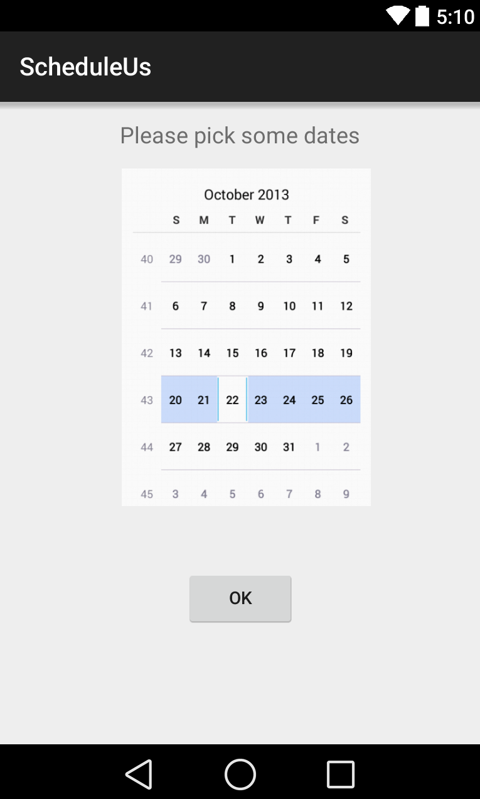
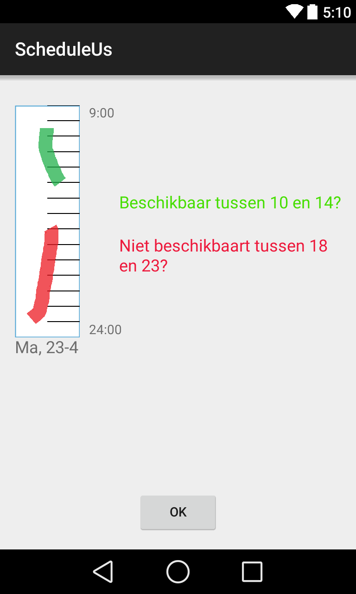
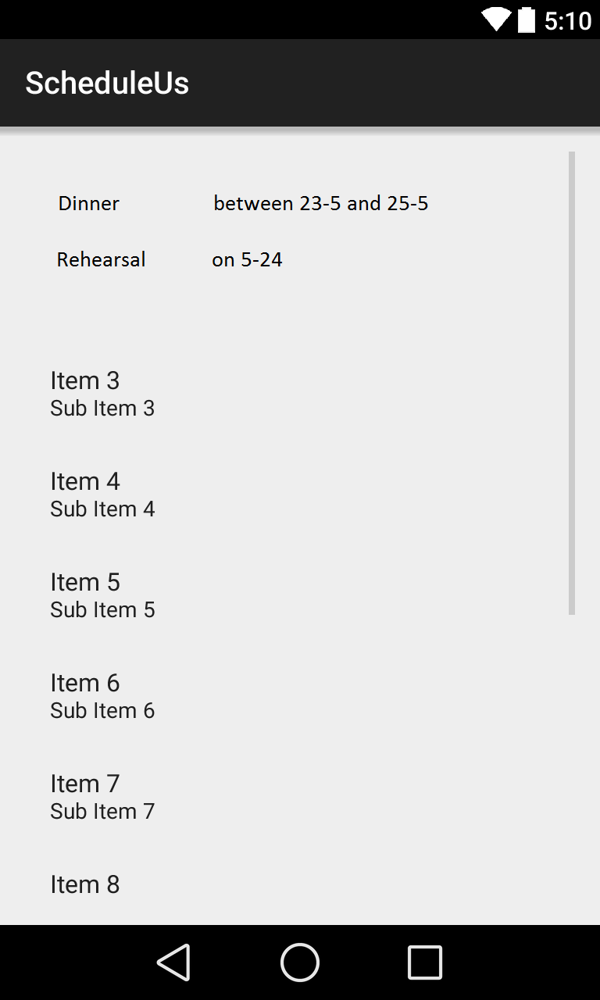

# Design file
Paul Broek
10279741
Android

Probleemomschrijving
------------
Bij het maken van een gezamenlijke afspraak loopt men tegen het probleem aan dat de overlap tussen lege ruimtes in agenda's pas te achterhalen valt als men alle agenda's kent. Deze app zal er om draaien om door middel van het swipen over de weekdagen, vrije tijden af te leiden waarin afspraken (*events*) kunnen worden gepland. Een *initiator* van een *event* kan vrienden uitnodigen via Facebook of WhatsApp. Omdat ik me enkel op Android OS richt zullen de meeste gebruikers via een web client hun voorkeuren moet aangeven, maar dit valt voor zover ik nu kan bezien buiten het bereik van dit vak. De meerwaarde van deze app zal zijn dat de gebruikers zo snel en gerieflijk mogelijk tot een gemeenschappelijk tijdslot komen. Bestaande apps en sites voor dit probleem leunen erg zwaar op gefixeerde blokken van tijdsloten, terwijl door de swipe manier mogelijk een onvoorspelbare oplossing kan worden gevonden. 

Features
------------
* Globaal weekoverzicht vs gedetailleerd dag overzicht
* User input heel vriendelijk verwerken, van getallen/swipes naar kloktijden
* Swipe-invoer EN handmatig
* Facebook en WhatsApp invites sturen en ontvangen.
* Synchroniseren met SQLite database voor lijst met events
* 

Classes & public methods
--------------------
* MainActivity, openingsscherm met buttons naar MyEvents en NewEvent
* MyEvents, lijst met events waar gebruiker bij betrokken is
* NewEvent, CalendarView waar gebruiker data selecteert, verwijst vervolgens naar PickTime activity
* PickTime, swipen over een dag geeft de beschikbaren tijden van die dag
* CalendarView, maar moet worden aangepast voor het selecteren van meerdere dagen
* ListViews met adapter voor het weergeven van involved events
* DbHelper.java, Android interface voor interactie met SQLite databse. Overrides SQLiteOpenHelper.
* StatusContract.java, constante waarden van database *ScheduleData.db*
* RefreshService.java, verbinden met cloud en ophalen van data naar locale database

APIs
-----------------
* Facebook, invitable_friends
* Android content providers

Data
-------------
Iedere gebruiker die is aangesloten bij een event levert zijn eigen 'data'. Een ArrayList<Day> met 7 items voor iedere gebruiker levert alle benodigde informatie om bijvoorbeeld een week weer te geven. Daarnaast zal een SQLite implementatie nodig zijn om alle geregistreerde *events* op te slaan en op meerdere toestellen te raadplegen, eventueel uit te breiden met gebruikers gegevens.

Onderdelen
------------
* Openingsscherm met de mogelijkheid om een nieuw event aan te maken of eerdere events te wijzigen.
* *New event* scherm waar de *initiator* een titel met optionele omschrijving invoert en betrokken vrienden/personen selecteert d.m.v. Facebook / WhatsApp API.
* Een *Submit preferences* scherm waar de gebruiker eerst alle mogelijke dagen ziet met datum. De *initiator* zal dit scherm als eerste zien en ziet daarom bovendien de mogelijkheid om globaal aan te geven wanneer deze afspraak plaats zal hebben (in dagen via een CalendarView). Daarna krijgt hij een blanco overzicht te zien van deze weekdagen. Als hij vervolgens op een van de dagen klikt kan hij finetunen op welke momenten hij op die dag kan door middel van swipes.

Platform
-------------
Voor het uitnodigen van vrienden wordt de invitable_friends API van Facebook gebruikt; zeer gangbaar en goed gedocumenteerd. Daarnaast biedt Android nuttige *Views* zoals *CalendarView* en *DatePicker* voor de eerste handmatige invoer van de initiator. 

Mogelijke problemen
-------------
* De mogelijkheid tot corrupte databases als een gebruiker zijn preferenties invoert, terwijl de initiator bepaalde dagen uit het event heeft gehaald. Ik zal dus eerst de database moeten raadplegen met een query of het aantal dagen nog overeen komt.

Vergelijkbare applicaties
-------------
* Doodle, werkt met vaste blokken en mensen uitnodigen per email. 
* Calendly.com, synchroniseert met Google Calendar, zodat ook nieuwe gezamenlijke afspraken meteen worden "opgeschreven" in ieders agenda. Werkt handig met repeterende of periodieke afspraken. 
* needtomeet.com lijkt het meest op mijn concept plan. Ze richten zich op grote groepen mensen, die allen per dag blokken selecteren waarin ze beschikbaar zijn.

Overzicht van activities
---------------

