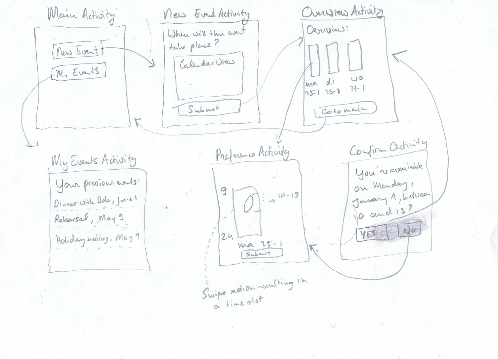

# ScheduleUs
Programmeerproject UvA, juni 2015
Paul Broek
10279741
OS: Android

Probleemomschrijving
------------
Bij het maken van een gezamenlijke afspraak loopt men tegen het probleem aan dat de overlap tussen lege ruimtes in agenda's pas te achterhalen valt als men alle agenda's kent. Deze app zal er om draaien om door middel van het swipen over de weekdagen, vrije tijden af te leiden waarin afspraken (*events*) kunnen worden gepland. Een *initiator* van een *event* kan vrienden uitnodigen om tot gezamenlijke tijdsloten te komen. De meerwaarde van deze app zal zijn dat de gebruikers zo snel en gerieflijk mogelijk tot een gemeenschappelijk tijdslot komen. 

Features
------------
* Globaal weekoverzicht vs gedetailleerd dag overzicht
* User input vriendelijk verwerken, van getallen/swipes naar kloktijden
* Andere ScheduleUs gebruikers inviten.
* Synchroniseren met Parse database voor gebruikersdata en beschikbare tijden van gebruikers

Data
-------------
Iedere gebruiker die is aangesloten bij een event levert zijn eigen 'data'. Een ArrayList<Day> met 7 items voor iedere gebruiker levert alle benodigde informatie om bijvoorbeeld een week weer te geven. Daarnaast zal een SQLite implementatie nodig zijn om alle geregistreerde *events* op te slaan en op meerdere toestellen te raadplegen, eventueel uit te breiden met gebruikers gegevens.

Onderdelen
------------
* Openingsscherm met de mogelijkheid om een nieuw event aan te maken of eerdere events te wijzigen.
* *New event* scherm waar de *initiator* een titel invoert en dagen selecteert.
* Een *Select Days* scherm waar de gebruiker eerst alle mogelijke dagen ziet met datum. De *initiator* zal dit scherm als eerste zien en ziet daarom bovendien de mogelijkheid om globaal aan te geven wanneer deze afspraak plaats zal hebben (in dagen via een TimePicker). Daarna krijgt hij een blanco overzicht te zien van deze weekdagen. Als hij vervolgens op een van de dagen klikt kan hij finetunen op welke momenten hij op die dag kan door middel van swipes.
* Een overzichts scherm *My Events* met alle events waar de gebruiker aan deelneemt.

Platform
-------------
Voor het uitnodigen van vrienden wordt de invitable_friends API van Facebook gebruikt; zeer gangbaar en goed gedocumenteerd. Daarnaast biedt Android nuttige *Views* zoals *CalendarView* en *DatePicker* voor de eerste handmatige invoer van de initiator. 

Vergelijkbare applicaties
-------------
* Doodle, werkt met vaste blokken en mensen uitnodigen per email. 
* Calendly.com, synchroniseert met Google Calendar, zodat ook nieuwe gezamenlijke afspraken meteen worden "opgeschreven" in ieders agenda. Werkt handig met repeterende of periodieke afspraken. 
* needtomeet.com lijkt het meest op mijn concept plan. Ze richten zich op grote groepen mensen, die allen per dag blokken selecteren waarin ze beschikbaar zijn.
* 

.png)

Eerste schetsen
---------------

