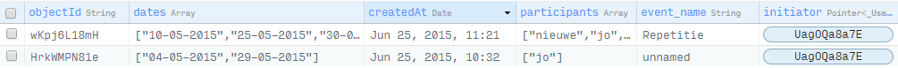

# Verslag ScheduleUs
Paul Broek  
10279741  
**Android**  
25 juni, 2015

Inleiding
--------------------
### Aanleiding
Wanneer men een afspraak wilt maken met meerdere personen, ontstaat een probleem van onvolledige informatie. 
Van ieder persoon bestaat een weekrooster waarin hij of zij beschikbaar is, maar deze gegevens zijn niet altijd snel beschikbaar. 
Mijn app richt zich op het vinden van gemeenschappelijke tijdsloten waarin alle deelnemers beschikbaar zijn. De invoer van beschikbare tijden moet eenvoudig en duidelijk zijn. De gebruiker moet het overzicht behouden. 

### App omschrijving
De gebruiker kan de app enkel gebruiken als hij zich heeft geregistreerd. Dit kan door een gebruikersnaam en wachtwoord in te voeren. Voor ingelogde gebruikers bestaat de app uit twee hoofdfunctionaliteiten:
* Het creëren van een *event*, het voorstellen van dagen en uitnodigen van *participants*
* Het bekijken van *events* waaraan de gebruiker deelneemt en het opgeven van beschikhaarheid

De overlap tussen deze twee functionaliteiten zit in het het bekijken van geselecteerde dagen en het invullen van beschikbare tijdsloten. In de *Core* sectie zal herhaaldelijk terugkomen dat deze twee functionaliteiten als gescheiden binnen activities bestaan.

Core
--------------------
### Activities
Allereerst een bondig overzicht van alle aanwezige activities in de app, gerangschikt op min of meer chronologische volgorde. Screenshots van alle activities en mogelijke screens per activity zijn te vinden in README.md
* **CheckLoginActivity**, schijn activity dat controleert of er een gebruiker is ingelogd. Verwijst vervolgens naar MainActivity of UserStartActivity. Heeft geen layout xml file.
* **UserStartActivity**, laat gebruiker inloggen of een account creëren. 
* **SignUpActivity**, registratie activity waar gebruiker een naam en wachtwoord opgeeft.
* **LoginActivity**, maakt verbinding met Parse om gebruiker in te loggen, als er geen errors zijn volgt MainActivity
* **MainActivity**, geeft gebruiker mogelijkheid nieuw event te maken of zijn events te bekijken.
* **NewEventActivity**, hier geeft de gebruiker een naam voor het event op. Daarnaast kan hij data prikken voor zijn event. Als hij tevreden is over deze lijst met data kan hij naar SelectDaysActivity
* **SelectDaysActivity**, dit is een overzichts activity dat de zojuist gegeven dagen nog als leeg weergeeft. De gebruiker kan dagen verwijderen. Door op één van de dagen te klikken verschijnt SelectTimesActivity
* **SelectTimesActivity**, de activity waar de hele app in feite om draait. Hier swipe't de gebruiker over een dag om zijn tijden te specificeren. Door op *Show* te klikken leidt de app tijdsloten af. Er kan ook meteen op *Confirm* worden geklikt, dan worden de geselecteerde tijden opgeslagen en komen we terug bij SelectDaysActivity
* **InviteActivity**, als de gebruiker klaar is met het selecteren van dagen en/of tijden, kan er op OK worden geklikt. Nu verschijnt er een lijst met ScheduleUs gebruikers die de gebruiker kan aanvinken om uit te nodigen. Als er op *Invite* wordt geklikt verschijnt er een *Toast* met wie er zijn uitgenodigd en komt de gebruiker terug bij MainActivity.
* **MyEventsActivity**, geeft overzicht met events waar de gebruiker initiator of participant van is. Als er op een event wordt geklikt verschijnt opnieuw SelectDaysActivity, maar nu ingevuld met gemeenschappelijke tijden. 

### Klassen

* **Application.java**, verbinding maken met Parse database. Globale variabelen worden gedefiniëerd, zoals vele Maps om makkelijk van een datum de ingevulde tijden te vinden.
* **DrawingView.java**, de zelfgemaakte View voor het invullen van beschikbare tijden. Als de gebruiker over dit object swipe't beweegt er een cursor mee en wordt een rechthoek getekent tot de plek waar de gebruiker loslaat. Er kan over een bestaande rechthoek worden getekent. De klasse bevat methodes om te tellen hoeveel ruimte is ingevuld en om de pixels in kloktijden te vertalen.
* **DrawingShowView.java**, overeenkomstig met bovenstaande klasse, maar deze View dient enkel om een ArrayList<int[]> te tonen. Door de verhouding pixels per uur te berekenen na OnSizeChanged, worden te tijden altijd juist weergegeven. 

* **dayListAdapter.java**, voor het weergeven van de combinatie DrawingView, TextView en delete Button
* **shared_dayListAdapter.java**, voor het weergeven van de combinatie DrawingView, TextView
* **timeListAdapter.java**, voor het weergeven van geselecteerde tijden.
* **userListAdapter.java**, voor het weergeven van een TextView en een CheckBox

### Externe bibliotheken en data
* **Google Guava library v17.0**, voor makkelijke conversie van List<Integer> naar int[].
* **Parse library**, voor gebruik van Parse functie om queries te verzenden, Parse objecten te creëren en gebruikers in te loggen.
* **Google GSON library v2.3**, voor makkelijke conversie van **JSON object** (van Parse) naar  **List<List>** (Java)
* **Lucasr TwoWayView**, voor het gebruik van een horizontale ListView, die niet beschikbaar is als CustomView.
* Assets folder bevat **Unique.ttf**, de lettertype van ScheduleUs in het openingsscherm. 
* values folder bevat: Strings.xml voor namen van knoppen en standaardberichten, styles.xml voor app theme en horizontale oriëntatie van de TwoWayView, colors.xml voor veelgebruikte kleuren en attrs.xml om mijn custom View DrawingView al resource the definiëren. 

### Problemen

**Parse**  
Ik was aanvankelijk van plan om SQLite te gebruiken voor mijn user data. Op advies van medestudent Joram heb ik gekozen voor de libraries en online datastorage van *Parse.com*. Dit stelde mij in staat binnen vier weken daadwerkelijk een goed functionerende datastructuur te bouwen, in plaats van veel tijd te verliezen met het opbouwen van een eigen database. Echter kwamen er ook complicaties bij. Zo moet alle data in JSON objecten worden weggeschreven. Later volgde de vertaalslag van JSON objecten naar Java ArrayLists, waarvan onbekend was hoe het JSON object gestructureerd is. Hiervoor heb ik in de loop der tijd twee libraries moeten aanboren, *Google Guava* en *Google GSON* (zie paragraaf boven). Er onststonden veel problemen bij het implementeren van de Guava library, omdat - zo bleek later - er overeenkomstige Java functies in andere Google libraries stonden. Omdat mijn ervaring met het toevoegen van libraries in Java nul was heb ik meerdere malen problemen in ondervonden, zoals bij het implementeren van een custom View.

**DrawingView**  
Al snel kwam ik er achter dat mijn 'nieuwe' manier van user input voor tijdgegevens inderdaad nog niet vergelijkbaar op het internet te vinden was. Ik besloot eerst om een paint widget te bouwen, waar dikke lijnen mee kunnen worden getekend (zie design.md). Omdat dit een rommelig design bleek te geven besloot ik over te gaan op het geheel vullen van een witte rechthoek.  
De View moest ook terug kunnen geven welke tijden er daadwerkelijk zijn gevuld. Dit gaat door middel van de bool array *getAvailabilityArray()* die voor elke pixel nagaat of er user input staat, met een tolerantie van 5 pixels. Vier lijnen van groene pixels worden dus genegeerd als tijdslot, omdat dit mogelijk een misclick is. Daarna wordt de array vertaald naar een lijst van tijden op een manier zoals deze ook uiteindelijk in de database komt te staan. Dit gaat met *getAvailabilityList()*, die bijvoorbeeld [[9,15,10,30],[20,30,22,00]] teruggeeft. De gebruiker is dan op een zekere dag beschikbaar tussen 9:15 en 10:30, maar ook tussen 20:30 en 22:00.

**TwoWayView, uitbreiding van ListView**  
Android beschikt over widgets om meerdere items in lijsten te tonen en er vervolgens doorheen te scrollen. Deze wdigets zijn echter allemaal verticaal georiënteerd. Al snel kwam ik er achter dat meer mensen met dit probleem kampten en wezen diverse fora naar de *TwoWayView* van Lucas Rocha (https://github.com/lucasr/twoway-view). Deze custom View bevatte de simpele functionaliteit om horizontaal door een lijst met items te kunnen scrollen, iets wat ik nodig had voor de langwerpige dag weergave van DrawingShowView. Ook hier ontstonden veel problemen met het implementeren van deze library. 

**Verwerking user input**  
Aanvankelijk was ik van plan de gebruiker op twee manieren zijn tijden aan te laten geven, met rood kon hij aangeven wanneer hij niet kon en met groen wanneer hij wel kon. Ik heb al snel de overgestap gemaakt om alleen voor groen te kiezen. Dit maakt de app een stuk eenvoudiger en overzichtelijker. De witte ruimte kan worden opgevat als tijden waar één of meer mensen niet beschikbaar zijn.  
De gebruiker kan ook in SelectTimesActivity op Show klikken, en kijken welke tijden dit in cijfers precies zijn. Deze vertaling bleek vrij eenvoudig te zijn, alleen voor het gevallen van 9 uur, zoals '9:15'moest er een '0' aan de string geplakt worden voor een mooie evenredige weergave. 

**Gegevens opslaan naar database**
Dit is de relatief makkelijke kant van het dataverkeer. In InviteActivity (voor nieuwe events) en SelectDaysActivity (voor bestaande events) worden Parse objecten aangemaakt met gegevens als datums, de initiator, de deelnemers, beschikbare tijden en de onderlinge verhoudingen tussen deze klassen. Het Event object wordt bijvoorbeeld aan ieder AvailItem meegegeven. Uiteindelijk worden alle objecten definitief opgeslagen door middel van *AvailItem.saveInBackground()*. 

**Gegevens ophalen van database**  
Voor het ophalen van gegevens uit de Parse database wordt gebruik gemaakt van ParseQueries. Op dit query object kunnen vervolgens restricties worden losgelaten door middel van *.whereEqualTo*. Omdat meerdere items deze filter zullen doorstaan wordt gebruik gemaakt van een *findInBackground* callback om de objecten daadwerkelijk op te halen. Als dit misgaat wordt er altijd een error weggeschreven in de het logbestand. Nu gebruik ik deze methode meestal om vervolgens een ArrayAdapter en uiteindelijk een ListView te vullen met items. Dit vinden we terug in MyEventsActivity voor events, InviteActivity voor gebruikers en SelectDaysActivity voor het weergeven van beschikbaarheid per dag. Het lastigste geval doet zich echter ook voor in MyEventsActivity, maar dan om de JSON array's met beschikbaarheids eenheden te vertalen naar Java ArrayList<int[]>. De functie heet *getEventData()* en gebruikt onder andere Guava en Google GSON libraries om de conversie toe te passen. Dit leverde veel problemen op. Voor de laatste 10 dagen heeft het prima gefunctioneerd, maar het blijft een stukje code dat misschien eleganter geschreven zou kunnen worden. Zie volgende alinea voor hoe de verschillende gegevens worden opgeslagen.

### Database
Mijn database kennis stamde nog uit mijn middelbare schooltijd, het duurde dan ook even voordat ik kon ervaren wat de kracht van databases is. Alle klassen verwijzen naar elkaar, en dat maakt het ophalen van data in mijn app uiteindelijk doodeenvoudig. De database bestaat uit vier klassen: **_User**, **Event**, **AvailItem** en **SharedTime**. De klassen communiceren onderling met elkaar, de relaties zijn beneden te vinden in een schets. User is een standaard klasse van Parse met gegevens als username, password en createdAt. **Event** heb ik aangemaakt om events op te slaan, de belangrijkste key is de verwijzing naar de initiator en de lijst met participants.

**AvailItem** bevat van één dag alle tijdsloten van een gebruiker waarin hij beschikbaar is. Voor een nieuwe evenement van vijf dagen worden dus in InviteActivity vijf AvailItem objecten naar Parse gestuurd. 

**SharedTime** is waar de app om draait. Dit is een samenvoeging van AvailItems voor één event en één betreffende dag. Het proces van overlap zoeken gaat door middel van Cloud code. De implementatie volgt in de volgende paragraaf.

Deze schets geeft de relaties aan tussen de klassen. De vetgedrukte velden zijn referentie velden. Ze zijn of verwijzen naar een objectId. De blauwe velden bevatten arrays, hier ontstonden de grootste problemen, omdat ik in mijn app al een bepaald dataformaat had gekozen (ArrayList<int[]>) dat enige trucage benodigd om te verwerken. 

### Cloud code
Aanvankelijk had ik een functie geschreven in MyEvents dat AvailItems kon vergelijken en gemeenschappelijke tijdsloten kon produceren. Het probleem was echter dat iedere telefoon dan een ander overlap rooster met zich meedraagt wat voor conflicten zorgt bij het uploaden van data. Om dit te kunnen verhelpen is de cloud code implementatie onvermijdelijk. Deze dienst van Parse.com faciliteert in onder andere een beforeSave en een afterSave functie die inkomende requests kunnen bewerken. Zo laat ik in main.js (JavaScript cloud code file, te vinden in de map ScheduleUs/cloud) een beforeSave functie triggeren als er een AvailItem wordt opgeslagen. Er wordt voor gezorgd dat alle oude AvailItems van de betreffende user worden verwijderd zodat er een uniek object bestaat voor een specifiek evenement en dag. De afterSave die vervolgens getriggerd wordt haalt alle AvailItems op van één event en één dag en vergelijkt alle gebruikersgegevens. Per kwartier wordt er gegekeken of bijvoorbeeld [9,0,9,15] bevat is in de AvailItems van alle participants. Als dit zo is wordt de array weggeschreven in SharedTime. Als nu een gebruiker zijn MyEventsActivity opent verschijnt dus de overlap tussen AvailItems die tot dusver zijn ingeveld door de participants. Deze methode garandeerd dat de database niet corrupt wordt omdat inkomende server requests één voor één verwerkt worden. 

Conclusie
--------------
Uiteindelijk heb ik veel veranderingen doorgevoerd tijdens het ontwikkelen van deze app. Je zou kunnen zeggen dat alleen het basisidee 'swipen over weekdagen' is blijven hangen. Dit had te maken met dat ik toch niet volledig de user experience had uitgedacht. Ik wilde graag beginnen met programmeren en dat resulteerde in veel kleine trial en error overwinninkjes, daar waar ik het soms eerder over een totaal andere boeg had moeten gooien. Zo ontstonden er gaandeweg pas degelijke datastructuren, en besloot ik pas halverwege dit project om de belangrijkste data in Maps weg te schrijven. Het heeft me verbaasd hoe kleine functionaliteiten als een horizontale ListView en het weergeven van een lijst al snel veel en soms externe code vereisen.  
Ik ben tevreden over de user experience van de app, omdat dit voor mij aanvankelijk het belangrijkste doel was. De gebruiker kan inderdaad in een letterlijke handomdraai zijn preferenties aangeven en makkelijk door de app navigeren met de back knop of het menu. De terkortkomingen van de app liggen in de gemiste extra opties. Zo zou het fijn zijn als een gebruiker van alle deelnemers kan zien wat hun beschikbare tijden zijn, dan kan geconstateerd worden dat bijvoorbeeld één persoon een bepaald tijdslot uitsluit, en na overleg dus alsnog een gemeenschappelijk tijdslot worden gevonden. Daarnaast had ik graag een slider toegevoegd die meebeweegt met de user input bij de DrawingView. Ook richtte ik me enkele dagen op het integreren van Google API voor friends invites. Gezien de vele scenario's van het verwerken van een deeplink invitatie en de bijbehorende complicaties heb ik daar na een tijdje van afgezien. 
Al met al ben ik tevreden over het resultaat, gezien de korte duur van het project en de vele platformen die ik heb doorlopen: Parse database, JavaScript Cloud code, het hardcoded creëren van een Custom View en tijdelijk de Google API voor friend invites. Het is plezierig mijn ensemble leden voor het eerst te kunnen uitnodigen voor een repetitie met mijn eigen app.  

Paul  
26 juni, 2015

.png)
.png)
.png)
